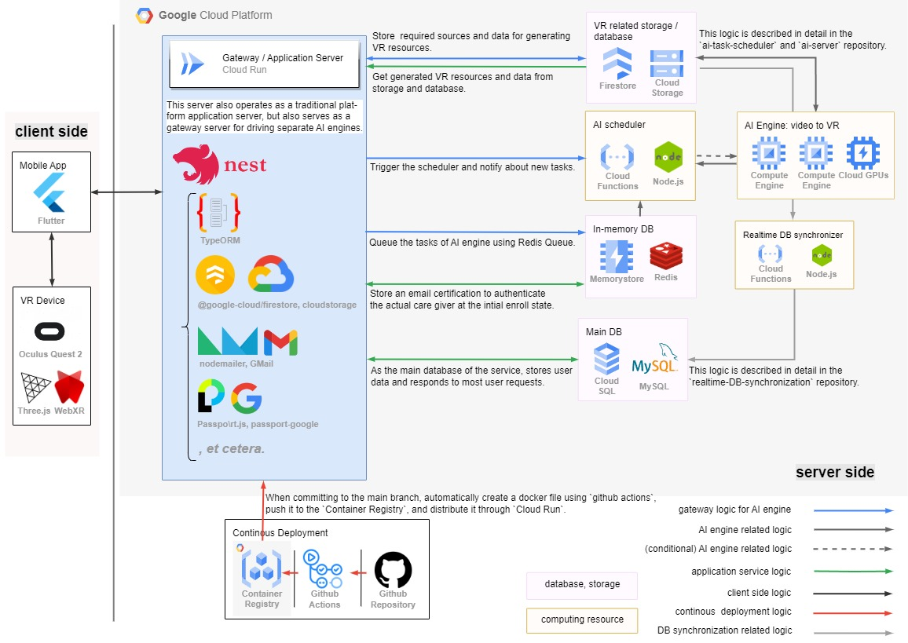

## 🔎 Overview

This server operates as a **`traditional application server`**, but also serves as a **`gateway server for driving separate AI engine`**. As a gateway server, it queues requests to the AI server, and stores request data and resources. And also as an application server, it runs a query on a database, reprocesses the information, and provides it, according to the user's request.

## 🛠 Architecture

## ⚙️ Features

> 📲 **API Documentation: [https://gateway-server-n3wk2vhygq-uc.a.run.app/docs](https://gateway-server-n3wk2vhygq-uc.a.run.app/docs)**

| Authentication                                                                                                                                                                                                                                                                                                                                                                                                                          | Group (care relaitonship)                                                                                                                                                                                                                                                                                                                                                                                                                                                                         | VR resources                                                                                                                                                                                                                                                                                                                                                                                                                                                                                                                                                                            |
| --------------------------------------------------------------------------------------------------------------------------------------------------------------------------------------------------------------------------------------------------------------------------------------------------------------------------------------------------------------------------------------------------------------------------------------- | ------------------------------------------------------------------------------------------------------------------------------------------------------------------------------------------------------------------------------------------------------------------------------------------------------------------------------------------------------------------------------------------------------------------------------------------------------------------------------------------------- | --------------------------------------------------------------------------------------------------------------------------------------------------------------------------------------------------------------------------------------------------------------------------------------------------------------------------------------------------------------------------------------------------------------------------------------------------------------------------------------------------------------------------------------------------------------------------------------- |
| - By using Google's OAuth2.0 method, make easier to join for this service.    - By using JWT method, reduce the difficulty of implementing the server for the session DB.   - By using refresh token, increase user experience by eliminating the inconvenience of frequently signing in.    - By setting refresh token's valid number of uses to 1, take security issues such as the takeover of fresh tokens. | - When first signing up, set a care giver (or care recipient) and connect relationship to create a group.    - In order to handle security issues, the care giver must enter in 30 minutes the certificate sent to the care recipient's email to connect.    - VR resources or \*badges are managed on a per-group basis.    (\* Badges are expected to serve as an easy way to know the status of reminiscence therapy, and as a motivation to encourage therapy.)   | - By using AI, users can convert video to VR resource.    - In the converting process, the load of AI server is enormous and takes a lot of time, so gateway server stores data to storage(Cloud Storage, Firestore) and triggers a message broker.    - After VR resource is generated in AI, data enters Firestore and Cloud Storage, and Cloud Functions automatically transfers data from Firestore to Cloud SQL (\*main DB).    - Sensitive files related to personal information was secured by utilizing a protect Cloud Storage bucket and signed URLs. |

## 🔧 Seperate small-scale logics

> These logics are represented by gray lines in the architecture diagram.

Thanks to two Cloud Functions functions, the logic of the gateway server was lightened, and the dependence on the AI server was reduced. To be precise, **it allowed the gateway server to not care about the AI server's state or task progress.**

### [AI task scheduler](https://github.com/RememberMe-2024-SolutionChallenge/AI-task-scheduler)

It is responsible for queuing requests to AI server. The dependency between AI server and gateway server was loosened by using push queue method and pull queue method together.

### [realtime-DB-synchronization](https://github.com/RememberMe-2024-SolutionChallenge/realtime-DB-synchronization)

It is responsible for synchronizing between Firestore and CloudSQL. When the AI server stores its result in Cloud Storage and Firestore, instant synchronization takes place from Firestore(sub DB) to CloudSQL(main DB).
