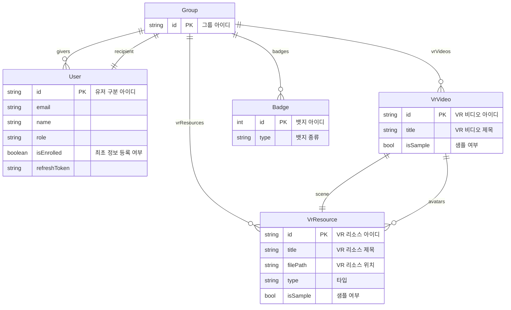

# ERD

## ERD of `main database`

> `main database` means the relational database which is responsible for storing and supporting application's most feature. It is based on `mysql` and `cloudSQL`.

### simplified ERD

- This ERD is simplified, You can read in the diagram on focusing the `group` entity.

  - e.g.: The group has vrResources, badges, etc.

- Sample VR resources and videos can be used from all users and groups.
  - If `isSample` field is `true`, then it doesn't have foreign for `group` entity.
